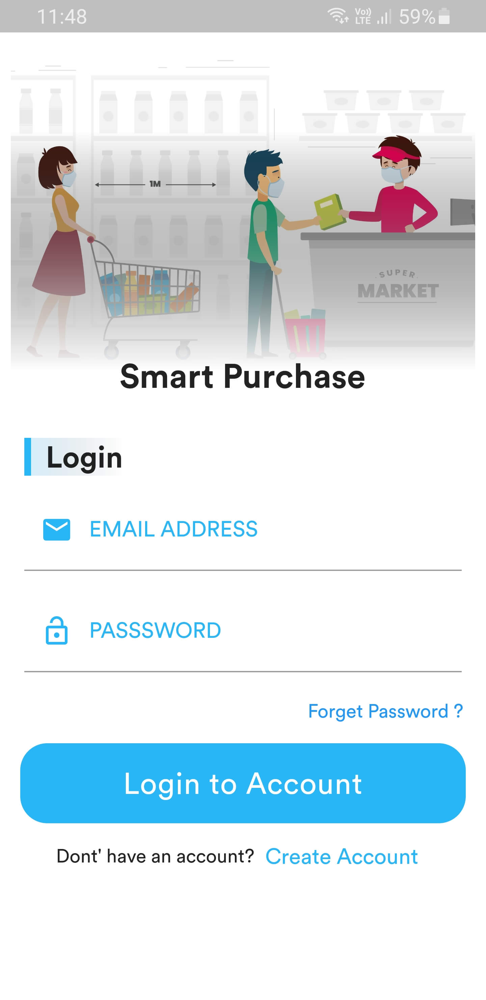

# SmartPurchase

This project was implemented to remove thefts in stores when adding items to trolley, to provide the location of sections in store, and to generate automated bills that will be displayed in the app when checking out.

## Author or creator of Mobile Application
Thanoraj Muthulingam : https://github.com/Thanoraj

## Authors or creators of System : 
Hariharan Raveenthiran : https://github.com/Hari25483

Santhirarajah Sivasthigan : https://github.com/SanthirarajahSivasthigan

## About

First we are finding the sections of supermarket such as Soap section, Biscuit section, Cosmetics section, Exit etc. by using video processing done to video feed coming the first camera and predicting the sections by using tf-lite model that was trained using the datasets of images of sections in food city. After finding the sections, real time location coordinates will be sent to cloud and the location will be displayed in mobile app.

Let me explain a simple scenario that can be done using my setup.

Assume that you are at the entrance of a food city, and you are going inside. There will be many sections in the food city according to the goods it has. First camera in our trolley (i.e) Main camera will find the sections using image processing and tflite, and it will update the location of the customer in the app in realtime.

Assume that you are going to add orange to your cart. First camera will predict whether it is an orange or not, and then when the customer puts that orange in to the trolley, the second camera inside the trolley will predict whether the item that is being put in to the trolley is same or different from the item that was captured by first camera. If item is same in both cameras, then that will be added to the shopping cart. Other wise bill will not be generated, and the shop owners will be notified.

You can find the repository for system and Raspberry pi code here: https://github.com/Hari25483/Super-Market-Smart-Trolley-System

## About this app

This app was designed for android. This app have user authentication, in-app product search function and location finder of product, realtime cart update system, automated chat bot with text recognition and voice recognition. 

for these we used: 
&nbsp;&nbsp;&nbsp;&nbsp;&nbsp;&nbsp;Firebase Auth 
&nbsp;&nbsp;&nbsp;&nbsp;&nbsp;&nbsp;Firebase Firestore Database 
&nbsp;&nbsp;&nbsp;&nbsp;&nbsp;&nbsp;Firebase Realtime Database 
&nbsp;&nbsp;&nbsp;&nbsp;&nbsp;&nbsp;Dialogflow ES 
    
Before running the code in your editor, make sure to complete all ToDos.

## Screenshots from the app:
</img>
</img>
</img>
</img>
</img>
</img>
</img>
